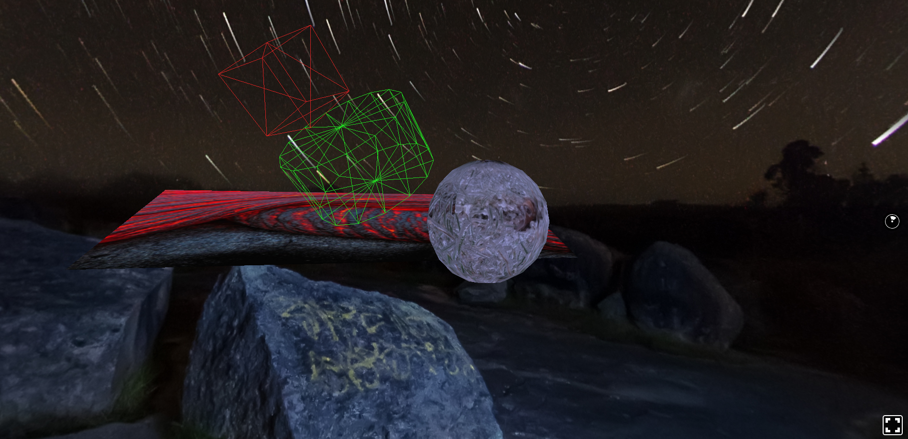

# Basics

## How to launch

Launch project (in Basics folder): `npm start`

Open browser at [http://localhost:8081/vr/](http://localhost:8081/vr/)

All the steps of this lesson are in '[sections](https://github.com/Raigyo/react-vr-apps/tree/master/Basics/sections)' folder.

Just replace the **Basics/index.vr.js** to test the feature.

## Basics - Concepts

Let’s also review the essential concepts we just learned:

- Components in React VR represent re-usable elements of the User Interface.

- The Pano component provides the environment of the VR application. It takes a source attribute where we can provide a relevant equirectangular 360° image.

- Props represent data inherited from Parent components. Parent components give child components props through special attributes.

- State represents the local and customizable data for components.

- Style provides a way to customize the look of components. Either use inline style attributes or the StyleSheet object to create a style.

- Flexbox provides an algorithm to dynamically layout objects according to their spatial differences.

- Transformations reposition components throughout the applications. These include translations and rotations.

- Events and cursor system provide a way to add interactivity through hovering within a React VR app.

## Ressources

360° images : [15Dkatz/react-vr-panos](https://github.com/15Dkatz/react-vr-panos/tree/master/images)
