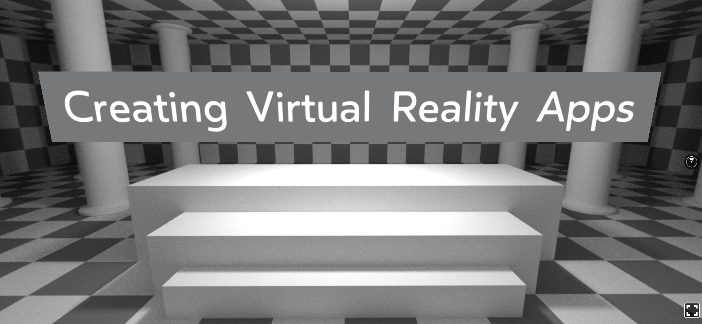
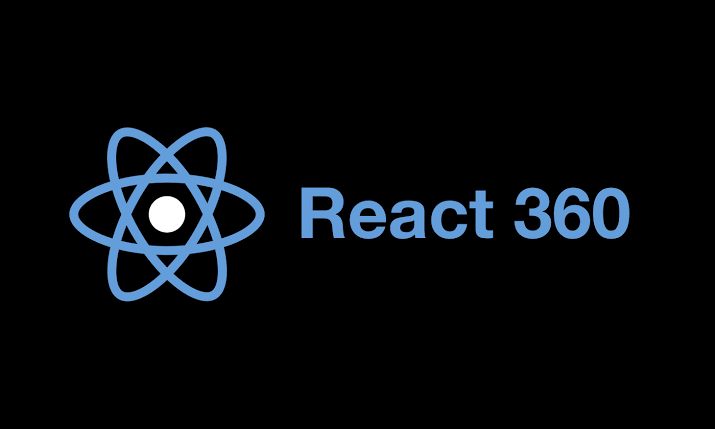

# React 360 / React VR - React VR - Creating Virtual Reality Apps

*February 2020*

> 🔨 Several applications using the Facebook React VR library. You could find the Udemy lesson followed [here](https://www.udemy.com/course/react-vr/)

* * *

# react-vr-guides

Completed Projects created while recording the react-vr course.

- [Basics](https://github.com/Raigyo/react-vr-apps/tree/master/Basics)
- [WorldTour](https://github.com/Raigyo/react-vr-apps/tree/master/WorldTour)
- [ShapeGame](https://github.com/Raigyo/react-vr-apps/tree/master/ShapeGame)
- WeatherSimulator (WIP)

## Create React VR Apps

~~~~

npm install -g react-vr-cli

npm install express

react-vr init MyApp

cd MyApp

npm start

~~~~

***
Find the original course here: https://www.udemy.com/react-vr/

Note: React VR is React 360 now - ([React 360 replaces React VR for streamlined development focus](https://engineering.fb.com/virtual-reality/react-360-replaces-react-vr-for-streamlined-development-focus/))

