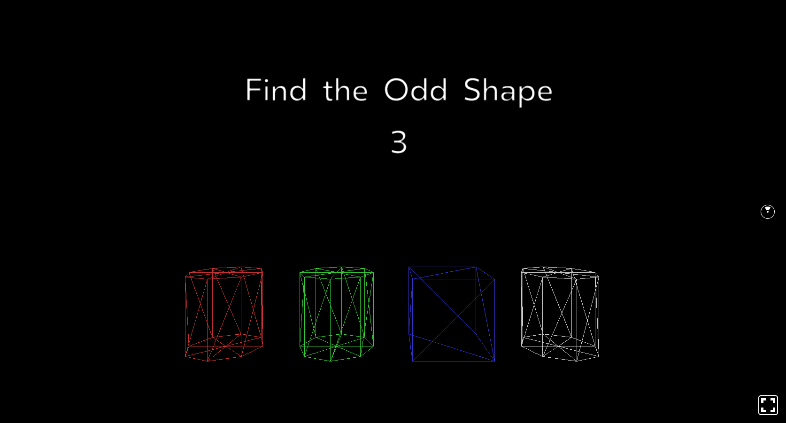

# Shape Game

## About

Game in which the player has to select the odd shape to earn points.

The score is saved on local storage.

## How to launch

Launch project (in ShapeGame folder): `npm start`

Open browser at [http://localhost:8081/vr/](http://localhost:8081/vr/)

## ShapeGame - Concepts

Let’s overview the main components of this application:

- We can represent a collection of objects by using an array of numbers.

- By using the .map function, we can create lists of objects dynamically with an array.

- The AsyncStorage component allows for a local history of string key and value pairs.

[Back to main](https://github.com/Raigyo/react-vr-apps)
