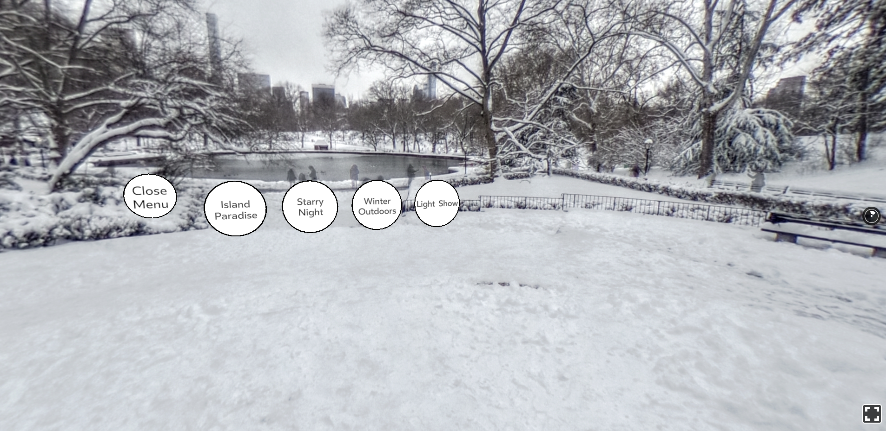

# World Tour

## How to launch

Launch project (in WorldTour folder): `npm start`

Open browser at [http://localhost:8081/vr/](http://localhost:8081/vr/)

## WorldTour - Concepts

In this section, you went used many of the previous components featured in Section One. Here’s just some of the highlights:

- We created a switchable button by switching a boolean value in the component and state to hide and unhide a menu component.

- The Pano component to represent different Virtual Reality worlds and environments.

Perhaps you’d like to extend this project even further! Here’s some challenge ideas:

- Add a couple more items to the places array to allow the user to transport to different environments.

- Create a custom version of World Tour that focuses on your favorite place - Museum Tour, City Tour, etc.

## Ressources

360° images : [15Dkatz/react-vr-panos](https://github.com/15Dkatz/react-vr-panos/tree/master/images)
